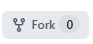
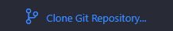
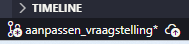
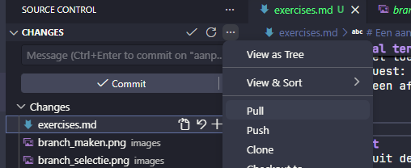
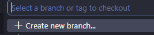
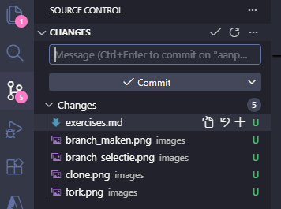
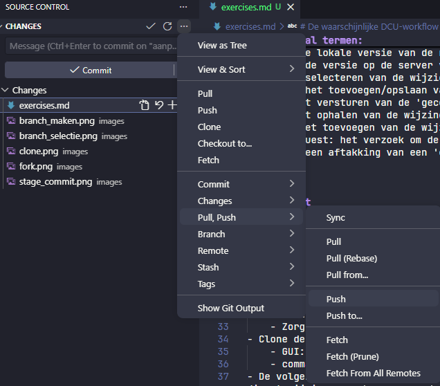

# Voorbereiding

- Maak een github account aan
- Na het aanmaken van je github account ga naar: https://github.com/schmitzdj/git_blaise_demo
- Klik op 'fork'  Je maakt hiermee een kopie, zodat we los van elkaar kunnen oefenen. Dit is niet iets wat je normaal hoeft te doen
- Installeer Visual Studio Code (https://code.visualstudio.com/)

# Een aantal termen

De onderstaande termen komen voorbij als je met git gaat werken. 
- Repository: de git map waarin ook de geschiedenis wordt bijgehouden
- Clone: maak een lokale kopie van de repository
- Local: de lokale versie van de repository/branch
- Remote: de versie op de server van de repository/branch
- Stagen: selecteren van de wijzignen die je wilt gaan 'committen'
- Commit: het toevoegen/opslaan van de aangebrachte wijzigingen
- Push: het versturen van de 'gecommitte' wijzigingen naar de repository op de server
- Pull: het ophalen van de wijzingen die op de server versie van de repository staan
- Merge: het toevoegen van de wijzingen aan een branch
- Pull request: het verzoek om de wijzingen op een branch te 'mergen' naar een andere branch
- Branch: een aftakking van een 'commit'

# Interface of command line
Je kan vanuit de command line of vanuit een GUI (Graphical User Interface) met git werken. Voor deze demo gaan we met de GUI van visual studio code werken. Hiermee worden op de achtergrond de commandos verstuurd die je normaal in de command line zou typen. Hieronder staat een beschrijving van hoe ik verwacht dat jullie workflow eruit gaat zien. 

# De waarschijnlijke DCU-workflow

- Maak bij de start van een project een git-repository (repo) aan.
    - Afhankelijk van de git-provider (github.com, gitlab.com, dev.azure.com) zit het er net even anders uit
    - Zorg dat de gitignore in de map staan want we willen alleen van de blax, layout en settings de wijzignen bijhouden.
- Clone de repository (iedereen die aan het project werkt maakt een eigen clone op haar/zijn computer)
    - GUI: 
    - command line: git clone [hier de url naar je repository]
- De volgende stap is het aanmaken een branch. Dit gaat in een paar stappen (N.B. de hoofdbranch heeft main. Je kan ook direct wijzingen aanbrengen op de main branch, maar de conventie is dat je eerst een nieuwe branch aanmaakt waarop je de wijzingen aanbrengt. Dit is vooral van belang als je samen aan een project werkt. Als je alleen werkt kom je vaak ermee weg om direct op de main te werken)
    - Zorg ervoor dat je de goede branch/commit hebt geselecteerd. 
        - GUI: 
        - command line: git checkout main
    - Pull altijd de laatste wijzingen. Je doet dit zodat je altijd de laatste versie van de (main)-branch hebt. Het kan namelijk zo zijn dat er all pull requests zijn goedgekeurd en er dus wijzingen in de repo op de server zitten. Met pull haal je deze op.
        - GUI: 
        - command line: git pull
    - Maak een nieuwe branch aan 
        - GUI: 
        - command line: git branch -b [naam van de nieuwe branch]
    - Kies een duidelijke naam
    - Vaak is de nieuwe branch ook meteen actief, maar selecteer anders handmatig de branch waarop je wilt werken
- Maak de wijzingen aan de code/enquete
- Stage de wijzingen. Met het plusje 'stage' je de wijzigingen. 
    - GUI: 
    - command line: git add [bestand waarvan je de wijzingen wilt stagen]
- Commit de wijzingen
    - Schrijf een commit message (b.v. routing vraag over inkomen aangepast). Klik daarna op commit
    - git commit -m [hier de commit boodschap]
- Push de wijzingen 
    - 
    - command line: git push
- Maak een pull request aan 
    - Hierbij kies je ervoor naar welke branch je wijzingen wilt mergen. Die mag elke branch zijn, maar in de praktijk gaat het bij jullie om wijzingen van jullie zelf aangemaakte branch naar main.
    - Kies een collega aan die de pull request moet bekijken. Dit is het moment om de wijzigen van je collega te beoordelen en te testen. Die kan puur op basis van de code, maar waarschijnlijker is het handiger om de branch van je collega te openen en dan te 'pullen'. Je hebt dan een kopie van de branch van je collega. Je nu b.v. de enquete testen om te zien of alles goed is gegaan.
    - Als je akkoord bent met de wijzigingen dan kan je de pull request goedkeuren. Na het goedkeuren worden de wijzigingen 'gemerged' naar de main branch (of de andere branch die je hebt uitgekozen)
- Feest! Je hebt alle git stappen doorlopen :-)

# Werkafspraken
Bij het gebruik van git is het belangrijk om niet tegelijkertijd op dezelfde plek in de code wijzingen aan te brengen, omdat je hierdoor een zogenaamd 'merge conflict' kan krijgen. Bij een merge conflict is het niet duidelijk of je de coed uit branch A of branch B de correctie versie heeft, omdat op de dezelfde plek (of plekken) in beide een wijziging is aangebracht. Je kan dit handmatig oplossen, maar liever voorkom je dat je een merge conflict krijgt. Het makkelijkst is om niet tegelijkertijd in hetzelfde bestand wijzingen aan te brengen, maar als dat niet mogelijk is om in ieder geval dus niet op dezelfde plek aan de code te werken. 

